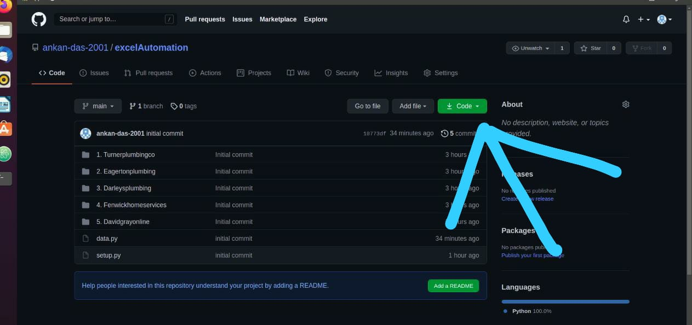
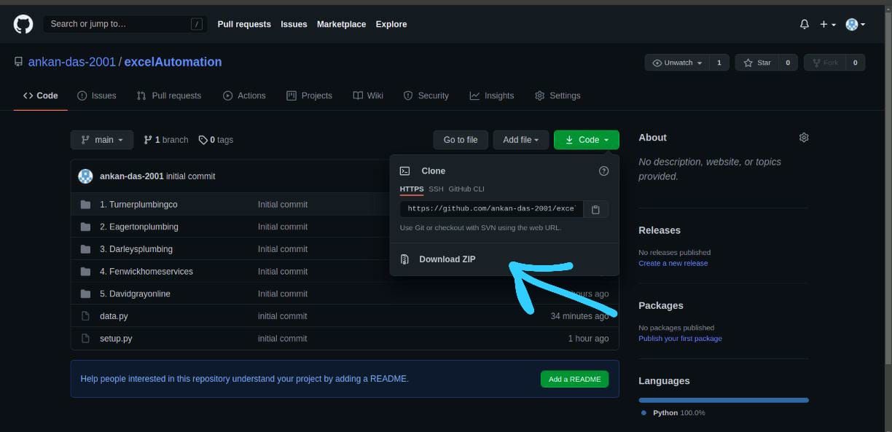
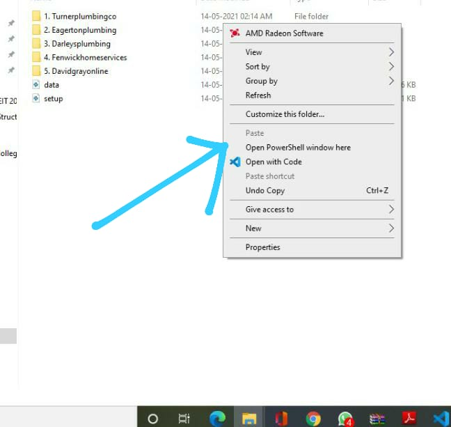
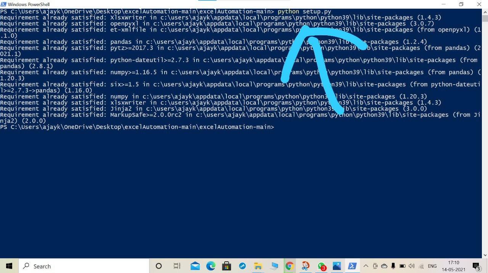
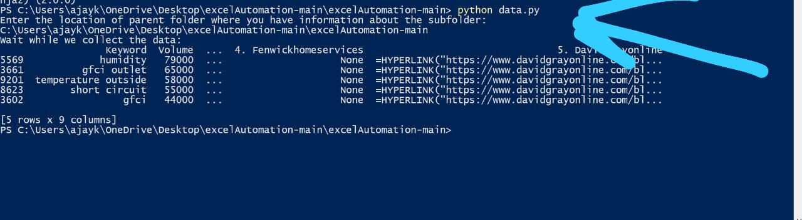

# **Steps on using this software**

- ## Click on code option as shown below

- ## Click on the download zip option as shown below

- ## After the zip file has been downloaded unzip the zip file
- ## Go to the folder where you have unziped the file. After that inside the my files open the powershell by pressing shift+right-click.

- ## After opening the powersheel by the method given above type the following code(Make sure you open the) and your internet should be connected while giving this command:
```
python setup.py
```

- ## After setup.py execution is completed type in the following command
```
python data.py
```
- ## After giving the command you will be asked to specify the filepath of the parent folder from where you want to get the sub folder and get the final data(See the picture given below)

- ## After you gave the filepath name(In the above picture I have given the parent file name as C:\Users\ajayk\OneDrive\Desktop\excelAutomation-Main\excelAutomationMain) Your filepath will be different. After giving the file name hit enter and wait for few seconds and you will see that a xlsx file has been created.
